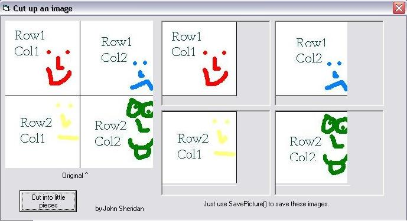



## Cut an image into 4 parts \- NO API

### Description

This is a responce to a question that was posted earlier. It cuts an image into quarters without api. note: to save the images, use

SavePicture pic.Image, "C:\file.bmp"
 
### More Info
 

             |
---                |---
**Submitted On**   |2002-08-02 12:42:56
**By**             |[john sheridan](https://github.com/Planet-Source-Code/PSCIndex/blob/master/ByAuthor/john-sheridan.md)
**Level**          |Beginner
**User Rating**    |5.0 (15 globes from 3 users)
**Compatibility**  |VB 6\.0
**Category**       |[Graphics](https://github.com/Planet-Source-Code/PSCIndex/blob/master/ByCategory/graphics__1-46.md)
**World**          |[Visual Basic](https://github.com/Planet-Source-Code/PSCIndex/blob/master/ByWorld/visual-basic.md)
**Archive File**   |[Cut\_an\_ima113655822002\.zip](https://github.com/Planet-Source-Code/john-sheridan-cut-an-image-into-4-parts-no-api__1-37552/archive/master.zip)

